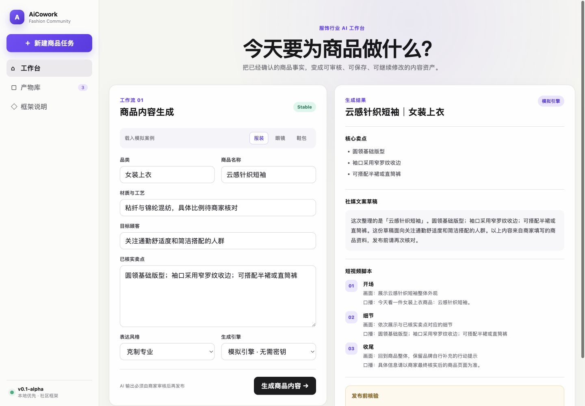

# AiCowork Fashion

面向服装、眼镜、鞋包和饰品等中小企业的本地优先 AI 工作台框架。

> 当前状态：`v0.1-alpha`。这是可以运行和二次开发的社区框架，不是成熟 SaaS，也不包含任何真实客户、订单或经营数据。



## 现在能做什么

- 在浏览器填写商品资料卡；
- 运行一条完整的「商品内容生成」工作流；
- 生成商品标题、卖点、社媒文案和短视频脚本；
- 将每次运行保存为本地产物；
- 无密钥使用模拟引擎，有模型密钥时调用兼容 `/v1/chat/completions` 的服务；
- 通过工作流清单和品类配置扩展自己的场景。

## 5 分钟启动

### 方式一：Docker

```bash
cp .env.example .env
docker compose up --build
```

打开 <http://localhost:8787>。

默认是模拟模式，不需要 API Key。要调用自己的模型，编辑 `.env`：

```dotenv
AICOWORK_PROVIDER=openai-compatible
AICOWORK_BASE_URL=https://你的模型服务/v1
AICOWORK_API_KEY=你的密钥
AICOWORK_MODEL=你的模型名称
```

密钥只由后端读取，不会返回给浏览器，也不应提交到 Git。

### 方式二：本地开发

需要 Node.js 20+ 和 Python 3.11+。

```bash
python3 -m venv .venv
source .venv/bin/activate
pip install -r apps/api/requirements-dev.txt

cd apps/web
pnpm install
pnpm build
cd ../..

uvicorn apps.api.app.main:app --reload --port 8787
```

## 从下载到第一次产出

1. 保持模拟模式启动；
2. 选择一个品类示例；
3. 补充商品名称、材质、目标顾客和已核实卖点；
4. 点击「生成商品内容」；
5. 在右侧查看结果；
6. 打开「产物库」查看历史结果。

模拟引擎只用于验证流程和界面。真实发布前，请使用自己的模型并由业务人员核验所有事实、功效描述和承诺。

## 项目结构

```text
apps/web/                    React + TypeScript 工作台
apps/api/                    FastAPI、模型适配器、任务与产物存储
workflows/product_content/   商品内容工作流清单、提示词与处理器
configs/categories/          服装、眼镜、鞋包品类配置
data/demo/                   纯模拟商品资料
tests/                       后端接口与工作流测试
```

更多说明：

- [架构与信任边界](docs/architecture.md)
- [API 与数据合同](docs/data-contracts.md)
- [版本路线图](docs/roadmap.md)
- [公开发布检查表](docs/release-checklist.md)
- [GitHub Release 流程](docs/github-release.md)

## 扩展一个工作流

每个工作流目录包含：

- `manifest.json`：名称、版本、输入字段和处理器入口；
- `prompt.md`：模型系统指令；
- `handler.py`：输入校验、模拟结果和模型结果解析。

复制 `workflows/product_content`，修改工作流 ID、清单和处理器入口，重启后端后即可被自动发现。工作流代码与主程序运行在同一进程中，因此只应安装你信任的工作流。

## 数据边界

- 默认只写入 `runtime/aicowork.db`；
- `.env`、`runtime/` 和上传产物默认不进入 Git；
- 当前版本不包含 CRM、客户明细、平台订单连接器、自动触达和定时任务；
- 示例中的品牌、商品、人物和经营信息均为模拟内容。

## 构建可下载源码包

发布打包器只接受公开文件白名单，并拒绝数据库、密钥、缓存、日志和本地运行目录：

```bash
python scripts/verify_public_tree.py
python scripts/build_release.py
```

输出位于：

- `release/aicowork-fashion-0.1.0-alpha.zip`
- `release/aicowork-fashion-0.1.0-alpha.zip.sha256`

该目录默认不进入 Git。正式仓库推送 `v0.1.0-alpha` 标签后，GitHub Actions 会重新执行检查并把这两个文件上传到 GitHub Release。

完成依赖安装和前端构建后，可以验证后端启动、健康检查和首页托管：

```bash
python scripts/smoke_boot.py --require-web
python scripts/e2e_model_smoke.py
```

第二条命令会在本机临时启动一个兼容模型服务，通过真实 HTTP 请求跑通“工作台 → 模型适配层 → 工作流解析 → 产物持久化”，不会访问外部网络或使用真实密钥。

## API

- `GET /api/health`
- `GET /api/status`
- `GET /api/categories`
- `GET /api/workflows`
- `POST /api/workflows/{workflow_id}/run`
- `GET /api/tasks`
- `GET /api/tasks/{task_id}`
- `GET /api/artifacts`
- `GET /api/artifacts/{artifact_id}`

## 许可证与来源

代码按 Apache-2.0 许可发布。品牌名称与标识不包含在代码许可中。代码来源说明见 [PROVENANCE.md](PROVENANCE.md)，依赖许可清单见 [THIRD_PARTY_NOTICES.md](THIRD_PARTY_NOTICES.md)。
