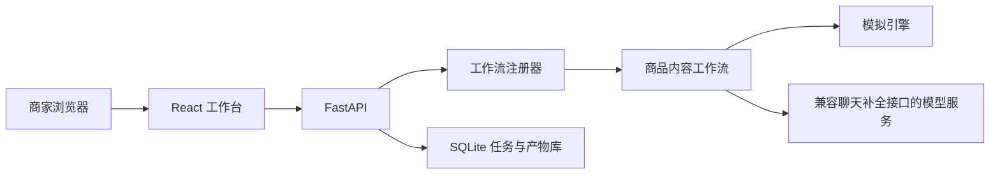

# Architecture

AiCowork Fashion v0.1-alpha 采用本地优先的单体部署：浏览器只访问 FastAPI，模型密钥只保存在后端环境变量中。

## 主要模块

### Web

`apps/web` 提供：

- 商品资料卡；
- 品类模拟案例；
- 生成引擎选择；
- 结构化结果预览；
- 本地产物库；
- 框架状态说明。

浏览器不会读取 `.env`，也不接收模型 API Key。

### API

`apps/api` 提供：

- 工作流发现；
- 输入合同校验；
- 模型服务适配；
- 任务状态；
- 产物持久化；
- 静态前端托管。

### Workflows

`workflows/*/manifest.json` 是公开发现清单，`handler.py` 是可信本地代码。当前不支持通过网页上传并执行 Python 工作流。

### Storage

任务与产物默认存入 `runtime/aicowork.db`。这个目录已加入 `.gitignore`，但部署者仍需自行负责磁盘访问权限、备份和删除策略。

## 信任边界

1. 商品输入由商家负责确认；
2. 后端只将当前工作流所需字段发送给配置的模型服务；
3. 模型输出必须经过结构校验，但结构正确不代表事实正确；
4. 所有发布内容仍需业务人员审核；
5. 工作流处理器拥有本地进程权限，只应安装可信代码。

## 为什么没有直接复用私有业务系统

公共框架采用新仓、新历史和新实现，避免将企业专属连接器、数据路径、客户资料及运行假设带入公共代码。未来能力应通过清晰的数据合同进入公共框架，而不是复制私有业务模块。
